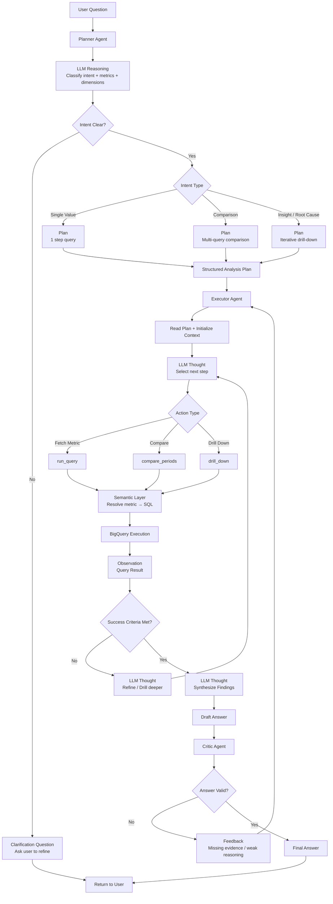

# AI Data Analyst Agent

**BigQuery + Semantic Layer + Google ADK**

An agentic AI system that explores business data using natural language, powered by:

- **Google ADK** — Agent orchestration
- **BigQuery** — Data warehouse
- **Semantic Layer** — Looker / custom abstraction
- **ReAct Reasoning** — Thought → Action → Observation
- **Planner → Executor → Critic** architecture

---

## Core Concepts

### 1. Planner Agent

Responsible for:

- Understanding user intent
- Selecting metrics and dimensions
- Defining analysis strategy

Example output:

```json
{
  "intent": "insight",
  "metrics": ["revenue"],
  "time_range": "last_7_days",
  "comparison_range": "previous_7_days",
  "dimensions": ["channel"],
  "drilldown_path": ["campaign"],
  "success_criteria": "identify cause of drop"
}
```

### 2. Executor Agent (ReAct Loop)

Executes the plan using iterative reasoning:

```
Thought → Action → Observation → Thought → ...
```

Capabilities:

- Run queries
- Compare periods
- Drill down across dimensions
- Detect anomalies

### 3. Critic Agent (Optional but Recommended)

Validates:

- Correctness of conclusions
- Completeness of analysis
- Alignment with data

### 4. Semantic Layer

The agent never writes SQL directly. Instead:

```python
run_query(metric="revenue", dimensions=["channel"])
```

Is translated internally to:

```sql
SELECT channel, SUM(amount) AS revenue
FROM orders
GROUP BY channel
```

---

## Available Tools

| Tool | Description |
| ---- | ----------- |
| `run_query(metric, dimensions, time_range)` | Execute a metric query against the semantic layer |
| `compare_periods(metric, dimensions, period_1, period_2)` | Compare the same metric across two time periods |
| `drill_down(context, dimension)` | Segment results by a new dimension |
| `list_metrics()` | List all available metrics |
| `list_dimensions()` | List all available dimensions |

---

## Supported Analysis Types

### Single Value

```
"What is revenue today?"
```

→ single query

### Comparison

```
"Compare revenue this week vs last week"
```

→ multiple queries + comparison

### Insight / Root Cause

```
"Why did revenue drop?"
```

→ iterative:

1. Detect anomaly
2. Segment (channel, country…)
3. Drill down (campaign…)
4. Identify root cause

---

## Architecture



### How to Read This Diagram

#### 1. Planner (top)

- Classifies the request
- Builds a structured execution plan
- Decides the analysis path: single value / comparison / insight
- If the intent is ambiguous or references unknown metrics → returns a **clarification question** directly to the user, skipping the executor entirely

#### 2. Executor — ReAct Loop (center)

The core reasoning engine. Runs iteratively until success criteria are met:

```text
Thought → Action → Observation → Thought → ...
```

- Keeps querying and drilling down until the answer is complete
- Each loop refines the analysis based on the previous observation

#### 3. Tool Layer — Semantic Abstraction (middle)

- The Semantic Layer translates metric requests into SQL
- BigQuery executes the generated query
- The agent never writes or touches raw SQL directly

#### 4. Critic (bottom)

- Validates the draft answer for correctness and completeness
- If the answer is weak or incomplete, sends feedback back to the Executor to trigger re-analysis

---

## Tech Stack

| Technology       | Purpose                               |
| ---------------- | ------------------------------------- |
| Google ADK       | Agent orchestration framework         |
| BigQuery         | Cloud data warehouse                  |
| Looker / Custom  | Semantic layer / business abstraction |
| Python / FastAPI | Backend implementation                |
| Cloud Run        | Deployment                            |
| ReAct pattern    | Iterative reasoning                   |

---

## Project Structure

```
Agentic_aut/
├── agents/                    # ADK LlmAgent definitions
│   ├── planner.py             # Classifies intent, outputs AnalysisPlan
│   ├── executor.py            # ReAct loop with tools
│   └── critic.py              # Validates and finalises the answer
│
├── tools/                     # ADK-compatible tool functions
│   ├── run_query.py
│   ├── compare_periods.py
│   ├── drill_down.py
│   ├── list_metrics.py
│   └── list_dimensions.py
│
├── semantic_layer/            # Metric/dimension definitions — no raw SQL in agents
│   ├── metrics.py
│   ├── dimensions.py
│   └── resolver.py            # Translates metric + dims → BigQuery SQL
│
├── bigquery/                  # BigQuery client and execution
│   ├── client.py
│   └── executor.py
│
├── orchestrator/              # ADK pipeline wiring
│   └── pipeline.py            # SequentialAgent([planner, executor, critic])
│
├── api/                       # FastAPI layer
│   ├── main.py
│   └── routes.py              # POST /ask, GET /metrics, GET /dimensions
│
├── models/                    # Pydantic schemas shared across layers
│   ├── plan.py                # AnalysisPlan, IntentType
│   ├── query.py               # QueryRequest, QueryResult
│   └── answer.py              # DraftAnswer, FinalAnswer
│
├── config/
│   ├── settings.py            # Env vars via pydantic-settings
│   └── guardrails.py          # Allowlists, max_steps, PII rules
│
├── tests/
│   ├── test_semantic_layer.py
│   └── test_guardrails.py
│
├── main.py                    # CLI entrypoint
├── requirements.txt
├── .env.example
└── Dockerfile
```

---

## Getting Started

### Prerequisites

- Python 3.11+
- Google Cloud project with BigQuery enabled
- Google ADK credentials (`google-adk`)
- Service account with BigQuery Data Viewer + Job User roles

### Installation

```bash
git clone https://github.com/your-username/Agentic_aut.git
cd Agentic_aut
pip install -r requirements.txt
```

### Configuration

Copy the example env file and fill in your values:

```bash
cp .env.example .env
```

```env
GOOGLE_CLOUD_PROJECT=your-project-id
GOOGLE_APPLICATION_CREDENTIALS=path/to/service-account.json
BIGQUERY_DATASET=analytics
MODEL_NAME=gemini-1.5-pro
```

### Run — CLI

```bash
python main.py
```

```
> Why did revenue drop last week?
```

### Run — API

```bash
uvicorn api.main:app --reload
```

```bash
curl -X POST http://localhost:8080/ask \
  -H "Content-Type: application/json" \
  -d '{"question": "Why did revenue drop last week?"}'
```

### Run — Docker

```bash
docker build -t agentic-analyst .
docker run -p 8080:8080 --env-file .env agentic-analyst
```

---

## Guardrails

| Guardrail | Description |
| --------- | ----------- |
| Metric allowlist | Restrict which metrics the agent is permitted to query |
| Query size limit | Cap result set size to control BigQuery costs |
| Max steps | Hard limit on Executor loop iterations to prevent runaway analysis |
| PII protection | Block dimensions or fields that could expose personal data |

---

## Roadmap

- [ ] Add caching layer (Redis / Firestore)
- [ ] Add memory (conversation context)
- [ ] Add alerting (proactive insights)
- [ ] Add dashboard integration (Looker / Streamlit)
- [ ] Multi-tenant SaaS support

---

## Why This Project Matters

This system is essentially an **AI Data Analyst on top of your data warehouse** — combining:

- **Semantic understanding** — knows your business metrics, not just SQL
- **Autonomous reasoning** — iterates until it finds the real answer
- **Structured analysis** — every step is traceable and explainable

---

## Future Improvements

- Multi-agent collaboration (dedicated planner / analyst / critic agents)
- Cost-aware query planning
- Anomaly detection models
- Auto-generated dashboards

---

## Author

Built by an engineer focused on AI agents, SaaS systems, and data-driven automation.

---

## License

This project is licensed under the MIT License.
